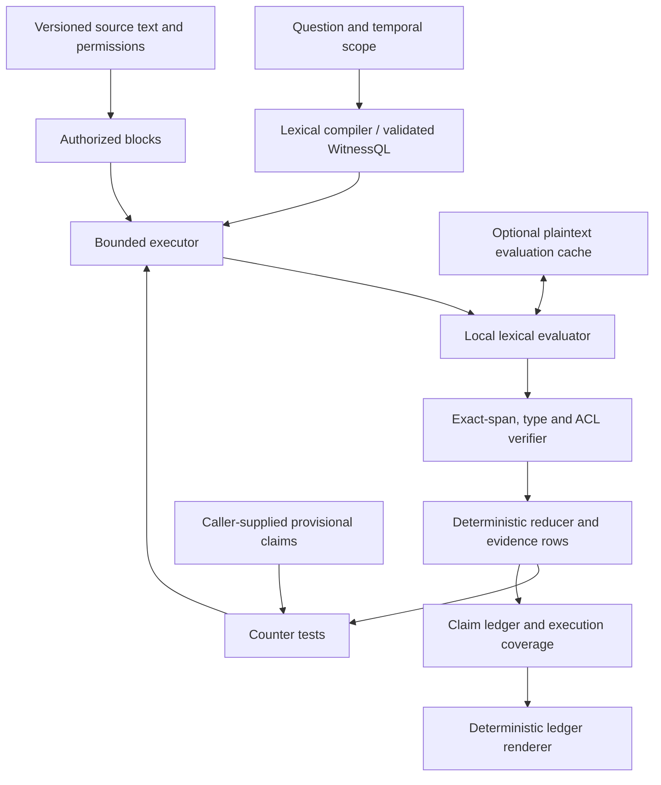

# Witness prototype architecture

## Implemented boundary

The lossless store, validated IR, local lexical evaluator, verifier, executor,
deterministic reducer, supplied-claim reconciliation, and caches below are
implemented. The bundled natural-language compiler and evaluator are
deliberately lexical fallbacks. Automatic provisional-claim construction,
semantic contradiction adjudication, and a generative renderer constrained at
the sentence-to-ledger level are target components, not completed production
features. The benchmark adapter exposes verified evidence rows rather than
pretending those missing model-backed stages were run.



The loop follows bounded configured scans; it is not a self-directed agent.
The diagram shows the engine contract. The benchmark scores evidence exposure,
not a generated end-to-end answer. Semantic models, semantic claim adjudication,
and a generative answer stage are future adapters, not hidden dependencies.

## Trust hierarchy

The implementation enforces this direction of authority:

```text
lossless versioned source
  -> exact verified witness span
    -> typed, defeasible bindings
      -> deterministic relation or aggregate
        -> evidence-linked claim
          -> rendered answer
```

No generated summary, graph edge, wiki sentence, binding, or answer becomes a
source of record. Derived objects carry the witness IDs from which they came.

## Components

### Corpus store

Documents retain raw content, source type, version, record/valid timestamps,
permissions, structure metadata, and a content hash. The store creates bounded
blocks with stable half-open character offsets. Blocks are execution units, not
semantic assertions; document structure and optional overlap can be retained
without changing source offsets.

### Compiler

The compiler turns a question into validated WitnessQL. The dependency-free
prototype includes a conservative deterministic compiler so the architecture can
be tested without a model key. A production compiler can implement the same
interface with grammar-constrained model output, independent validation, and
clarification on material ambiguity.

Compilation is a separately scored stage. An exhaustive executor cannot rescue a
plan that asks the wrong question.

Accordingly, the certificate reports **program execution coverage**, not proof
that the program adequately represents the natural-language question. A
production renderer must also receive a separately evaluated plan-adequacy
signal before making strong negative claims.

### Local evaluator

Each `(predicate, block)` pair is evaluated independently. The evaluator emits
`MATCH`, `NO_MATCH`, or `UNCERTAIN` plus zero or more candidate rows. The bundled
lexical evaluator uses no network or external tools and treats blocks as data.
The adapter interface is arbitrary in-process Python, not a sandbox. A high-recall policy sends uncertain
semantic cases forward; it does not convert low confidence into absence.

### Verifier

Candidate rows enter the evidence relation only after exact quote, offsets,
source version/hash, authorization, field types, dates, and numbers are checked.
Verification failures are explicit unresolved work or hard errors—not missing
rows silently accepted as `NO_MATCH`.

### Executor and reducer

Independent scans can run in parallel. Joins use bindings from verified rows, so
later hops are concrete evidence obligations rather than paraphrased searches.
Filters, set operations, arithmetic, sorting, grouping, and temporal resolution
are deterministic. Semantic grouping can propose a partition but cannot discard
members or quotations.

### Counter-witness phase

In the target design, the reducer produces provisional, evidence-linked claims.
A counter-test generator derives conditions that could defeat, qualify, narrow,
or supersede each claim. Those conditions become ordinary scans with the same
coverage and verification rules, and claim status is recomputed afterward.

The core prototype currently accepts provisional claims supplied by its caller
and performs that scan/reconciliation loop. The offline benchmark adapter uses
a bounded extractive provisional claim solely to exercise the mechanism; it is
not semantic contradiction adjudication.

### Ledger and renderer

The implemented claim ledger records support rows, counter rows, qualifiers,
and status. A minimal deterministic renderer copies only existing ledger claim
text, asserts only `SUPPORTED` or `QUALIFIED` entries that have supporting
witnesses, leaves unresolved/refuted entries non-asserted in the structured
ledger, exposes support and counter witness IDs, rejects citations absent from
the execution result, and carries the coverage certificate. Its output
explicitly marks semantic entailment as not evaluated: citation existence is
not proof that a span entails a claim. A future generative renderer must remain
behind this boundary and needs a separate semantic sentence-level validator.

### Demand-compiled views

The physical cache stores local evaluation results per canonical predicate,
source block hash, and evaluator version. Repeating a query reuses its view;
changed blocks alone are reevaluated. It predicts no global semantic schema.
Cache reuse is observable, versioned, and checked against cold execution.

## Coverage states

Every authorized block finishes in exactly one state:

- `scanned`: evaluator completed conclusively or emitted candidate rows;
- `soundly_skipped`: an exact metadata/lexical proof makes the predicate false;
- `approximately_skipped`: an explicitly lossy gate excluded it;
- `unresolved`: permission race, evaluator failure, or invalid output after retry;
- `uncertain`: physically scanned, but the evaluator could not make a conclusive
  semantic decision. In the executable schema this is a subset of `scanned`,
  not an additional disjoint shard bucket.

Conclusive coverage is `(scanned - uncertain + soundly_skipped) / authorized`.
Approximate skips never count toward a negative claim. A negative result is
rendered as an observation over this coverage, not an ontological assertion.
Certificates also report scheduled, conclusive, uncertain, and failed
predicate-by-shard obligations. They explicitly mark natural-language plan
adequacy as not evaluated.

## Implemented checks and security limits

- The bundled lexical evaluator treats source text as data. This does not
  establish prompt-injection resistance for a future model adapter.
- Custom evaluators run with the Python process's privileges; network,
  filesystem and resource isolation must be supplied by the integrating app.
- Schemas and enum values are closed; extra fields are rejected.
- Permissions are checked both at block scheduling and row verification.
- Source version/hash is checked after evaluation to detect time-of-check races.
- Caches include authorization scope or store only permission-neutral local
  results and reapply authorization before disclosure.
- Renderer output is validated against the claim ledger.

The caller must authenticate principals; the library only evaluates the labels
it receives. Disk stores and caches are plaintext, retain exact quotes, and
have no automatic TTL or complete erasure workflow. See
[data handling](DATA_HANDLING.md) and [security policy](../SECURITY.md).

## What this prototype cannot establish

The offline harness can validate execution semantics, invariants, synthetic
evidence recall, update behavior, and relative algorithmic costs. It cannot by
itself establish production semantic-evaluator recall, real model/compiler
quality, hosted GraphRAG quality, or economics at billion-token scale. Those are
explicit model-backed and deployment experiments, not assumptions filled in by
the benchmark.
